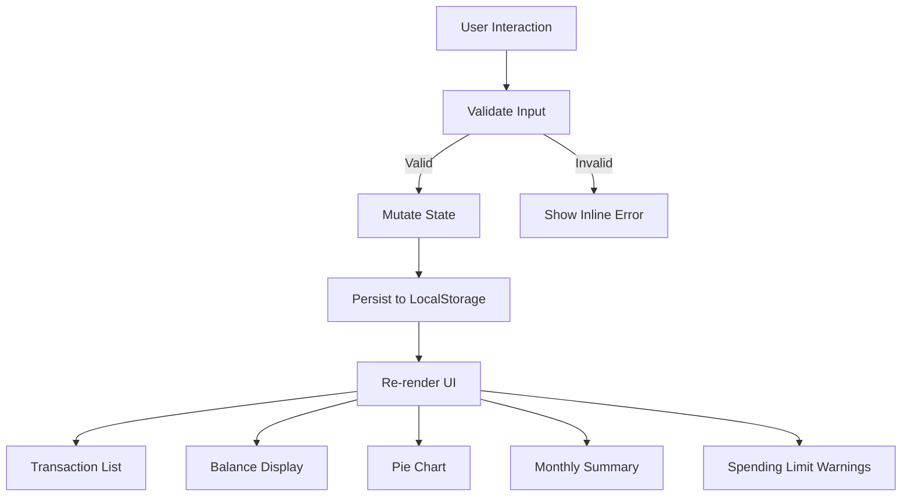

# Design Document — browser-app

## Overview

The browser-app is a fully client-side expense tracker delivered as a single HTML page. It requires no build tooling, no backend, and no framework — only HTML, CSS, and Vanilla JavaScript. All state is stored in the browser's Local Storage API and all rendering is done via direct DOM manipulation.

The app lets users record spending transactions (name, amount, category), view and delete them, see a running total balance, and visualize spending with a Chart.js pie chart. The five new capabilities added in this iteration are:

- **Custom categories** — users can define their own category labels beyond the three built-ins.
- **Monthly summary view** — aggregated totals grouped by calendar month and category.
- **Transaction sorting** — reorder the list by amount or category on demand.
- **Spending limit highlights** — per-category budget thresholds with visual warnings.
- **Dark/light mode toggle** — theme switching persisted to Local Storage with OS-preference fallback.

### Design Goals

- Zero dependencies beyond Chart.js (loaded via CDN).
- All logic runs synchronously in the browser; no async I/O except the initial Local Storage read on load.
- The entire app ships as a single `index.html` file with an embedded `<style>` block and a `<script>` block (or co-located `style.css` / `app.js` files — either layout is acceptable).
- State mutations always write to Local Storage before updating the DOM.

---

## Architecture

The app follows a simple **unidirectional data flow**:

```
User Action → State Mutation → Persist to Storage → Re-render UI
```

There is no virtual DOM or reactive framework. Every state change calls a central `render()` function (or a set of targeted render helpers) that rebuilds the affected DOM nodes from the current in-memory state object.

### Module Breakdown

```
app.js
├── storage.js      — read/write helpers for Local Storage
├── state.js        — in-memory state object + mutation functions
├── validator.js    — input validation rules
├── renderer.js     — DOM rendering functions
│   ├── renderTransactionList()
│   ├── renderBalance()
│   ├── renderChart()
│   ├── renderMonthlySummary()
│   └── renderSpendingLimitWarnings()
├── sort.js         — sorting comparators
├── theme.js        — dark/light mode logic
└── main.js         — event listeners + bootstrap
```

> **Note:** For a single-file delivery, all modules collapse into one `<script>` block with the same logical sections. The module names above describe logical separation, not necessarily file separation.

### Data Flow Diagram



---

## Components and Interfaces

### 1. Input Form (`#transaction-form`)

Fields:
- `name` — `<input type="text">`, required, non-empty after trim
- `amount` — `<input type="number" min="0.01" step="0.01">`, required, positive
- `category` — `<select>`, populated from `state.categories` (built-ins + custom)
- Submit button — `<button type="submit">`

Inline error container: `<div class="form-errors">` — cleared on each submission attempt, populated by `validator.js`.

### 2. Transaction List (`#transaction-list`)

Each entry is a `<li>` element containing:
- Transaction name
- Amount (formatted with `Intl.NumberFormat` as currency)
- Category badge
- Delete button (`data-id` attribute holds the transaction ID)
- Highlight class `over-limit` applied when the transaction's category has exceeded its Spending_Limit

### 3. Balance Display (`#total-balance`)

A single `<span>` updated by `renderBalance()`. Displays the sum of all transaction amounts formatted as currency.

### 4. Pie Chart (`#spending-chart`)

A `<canvas>` element managed by a Chart.js `Pie` instance. Updated via `chart.data.datasets[0].data = ...` + `chart.update()` rather than destroying and recreating the instance.

### 5. Category Manager (`#category-manager`)

- Text input + "Add" button for creating a Custom_Category.
- List of existing custom categories, each with a "Delete" button.
- Inline error area for duplicate/empty name validation.

### 6. Monthly Summary (`#monthly-summary`)

A `<section>` toggled visible/hidden by a navigation button. Contains a dynamically built table or list:

```
June 2025          $320.00
  Food             $120.00
  Transport         $80.00
  Fun              $120.00

May 2025           $210.00
  ...
```

### 7. Sort Control (`#sort-control`)

A `<select>` with options:
- `default` — insertion order
- `amount-asc` — amount ascending
- `amount-desc` — amount descending
- `category-asc` — category A–Z
- `category-desc` — category Z–A

The selected value is held in `state.sortOrder` (not persisted).

### 8. Spending Limit Panel (`#spending-limits`)

For each category in `state.categories`, a row with:
- Category name label
- Numeric input for the limit (empty = no limit set)
- Save button
- Warning badge shown when `state.categoryTotals[cat] >= state.spendingLimits[cat]`

### 9. Theme Toggle (`#theme-toggle`)

A `<button>` or `<input type="checkbox">` that calls `theme.toggle()`. The current theme is stored as a CSS class (`data-theme="dark"` or `data-theme="light"`) on `<html>` and persisted to Local Storage.

---

## Data Models

All persistent data lives in Local Storage under distinct keys.

### `transactions` key

```json
[
  {
    "id": "uuid-v4-string",
    "name": "Coffee",
    "amount": 4.50,
    "category": "Food",
    "date": "2025-06-15T09:30:00.000Z"
  }
]
```

| Field      | Type   | Constraints                        |
|------------|--------|------------------------------------|
| `id`       | string | UUID v4, generated at creation     |
| `name`     | string | Non-empty after trim               |
| `amount`   | number | Positive float, max 2 decimal places |
| `category` | string | Must match a name in `categories`  |
| `date`     | string | ISO 8601 timestamp (set at creation) |

### `categories` key

```json
["Food", "Transport", "Fun", "Groceries", "Health"]
```

Built-in categories (`Food`, `Transport`, `Fun`) are always present and cannot be deleted. Custom categories are appended to this array.

### `spendingLimits` key

```json
{
  "Food": 200,
  "Transport": 100,
  "Fun": 50,
  "Groceries": 150
}
```

Only categories with a limit set appear in this object. A missing key means no limit is configured for that category.

### `theme` key

```json
"dark"
```

Either `"dark"` or `"light"`. Absent key means fall back to `prefers-color-scheme`.

### In-Memory State Object

```javascript
const state = {
  transactions: [],       // Transaction[]
  categories: [],         // string[] — built-ins + custom
  spendingLimits: {},     // Record<string, number>
  theme: 'light',         // 'light' | 'dark'
  sortOrder: 'default',   // 'default' | 'amount-asc' | 'amount-desc' | 'category-asc' | 'category-desc'
  view: 'main',           // 'main' | 'monthly-summary'
};
```

`sortOrder` and `view` are session-only (not persisted).

---

## Correctness Properties

*A property is a characteristic or behavior that should hold true across all valid executions of a system — essentially, a formal statement about what the system should do. Properties serve as the bridge between human-readable specifications and machine-verifiable correctness guarantees.*

### Property 1: Transaction persistence round-trip

*For any* list of valid transaction objects, serializing the list to Local Storage and then deserializing it should produce a list where every transaction has all fields (id, name, amount, category, date) preserved exactly.

**Validates: Requirements 1.2, 2.4, 6.1, 6.2, 6.3**

---

### Property 2: Balance equals sum of transactions

*For any* list of transactions (including the empty list), the computed Total_Balance should equal the arithmetic sum of all transaction amounts — and should be zero when the list is empty.

**Validates: Requirements 4.2, 4.3, 4.4, 3.3**

---

### Property 3: Whitespace and empty inputs are rejected

*For any* string composed entirely of whitespace characters (spaces, tabs, newlines) or the empty string, submitting it as a transaction name, a custom category name, or any other required text field should be rejected by the Validator, leaving the relevant list unchanged and displaying an error message.

**Validates: Requirements 1.4, 8.3**

---

### Property 4: Custom category round-trip

*For any* valid custom category name (non-empty, non-duplicate), adding it via the Category_Manager and then reading the categories list from Storage should produce a list that contains that name; and the Input_Form category dropdown should include it.

**Validates: Requirements 8.2**

---

### Property 5: Spending limit highlight and warning consistency

*For any* category, any set of transactions, and any configured Spending_Limit, every transaction belonging to that category should be highlighted and a warning indicator should be shown if and only if the cumulative total for that category meets or exceeds the Spending_Limit — and neither highlight nor warning should appear when the total is below the limit.

**Validates: Requirements 11.2, 11.3, 11.4**

---

### Property 6: Sort order completeness

*For any* transaction list and any sort option (amount-asc, amount-desc, category-asc, category-desc, or default), the sorted result should contain exactly the same set of transaction IDs as the original list — no additions, no removals, no duplicates.

**Validates: Requirements 10.2, 10.3**

---

### Property 7: Monthly summary totals match transaction data

*For any* set of transactions spread across one or more calendar months, the sum of all per-month totals in the Monthly_Summary should equal the Total_Balance, and the sum of per-category totals within each month should equal that month's total.

**Validates: Requirements 9.1, 9.2, 9.3**

---

### Property 8: Theme persistence round-trip

*For any* theme value (`"dark"` or `"light"`), writing it to Storage and reading it back should return the same value, and the App should apply the corresponding CSS data-theme attribute on load.

**Validates: Requirements 12.3, 12.4**

---

### Property 9: Chart data consistency

*For any* set of transactions, the Pie_Chart dataset should contain exactly one entry per distinct category that has at least one transaction, and each entry's value should equal the sum of amounts for that category.

**Validates: Requirements 5.1, 5.2**

---

### Property 10: Spending limit persistence round-trip

*For any* map of category-to-limit values (all positive numbers), writing it to Storage and reading it back should produce an equivalent map with all entries preserved.

**Validates: Requirements 11.5**

---

### Property 11: Invalid spending limit rejected

*For any* value that is not a positive number (zero, negative, NaN, non-numeric string), attempting to set it as a Spending_Limit should be rejected by the Validator, leaving the existing limits unchanged and displaying an error message.

**Validates: Requirements 1.5, 11.6**

---

## Error Handling

| Scenario | Handling |
|---|---|
| Local Storage unavailable on load | Initialize with empty state; show non-blocking banner: "Storage unavailable — data will not be saved." |
| Local Storage parse error on load | Same as unavailable — log the error to `console.error`, initialize empty. |
| Local Storage quota exceeded on write | Catch `QuotaExceededError`; show non-blocking toast: "Could not save — storage full." Roll back the in-memory state change. |
| Chart.js not loaded (CDN failure) | Catch the missing `Chart` global; hide the chart canvas and show a static text fallback: "Chart unavailable." |
| Invalid transaction form submission | Inline error messages per field; form is not submitted; focus moved to first invalid field. |
| Duplicate or empty custom category | Inline error in Category_Manager; category not saved. |
| Invalid spending limit (non-positive) | Inline error in Spending Limit Panel; limit not saved. |
| Deleting a category that has transactions | Category is removed from the dropdown and from Storage; existing transactions retain their original category string (orphaned label displayed as-is). |

---

## Testing Strategy

### Approach

Because this is a pure client-side Vanilla JS app with no build tooling required, the testing strategy focuses on:

1. **Property-based tests** for pure logic functions (state mutations, validators, sort comparators, summary aggregation, storage serialization).
2. **Example-based unit tests** for specific edge cases and UI rendering helpers.
3. **Manual smoke tests** for browser compatibility across Chrome, Firefox, Edge, and Safari.

No test framework is mandated by the tech stack constraints. If a test harness is desired, [fast-check](https://github.com/dubzzz/fast-check) (property-based, browser-compatible, no build required via CDN) pairs well with a minimal test runner like [uvu](https://github.com/lukeed/uvu) or plain `console.assert` scripts.

### Property-Based Tests

Each property below maps to a Correctness Property in the section above. Tests should run a minimum of **100 iterations** per property.

| Test | Property | What varies |
|---|---|---|
| Storage round-trip | Property 1 | Random transaction objects (name, amount, category, date) |
| Balance sum | Property 2 | Random lists of 0–50 transactions with random positive amounts |
| Input rejection | Property 3 | Random whitespace strings (spaces, tabs, newlines, mixed) |
| Category round-trip | Property 4 | Random valid category name strings |
| Limit highlight consistency | Property 5 | Random category totals and limit values (above and below threshold) |
| Sort completeness | Property 6 | Random transaction lists, all five sort options |
| Monthly summary totals | Property 7 | Random transactions spread across multiple months/years |
| Theme round-trip | Property 8 | Both theme values (`"dark"`, `"light"`) |
| Chart data consistency | Property 9 | Random transaction sets across 1–N categories |
| Spending limit persistence | Property 10 | Random maps of category-to-positive-limit values |
| Invalid limit rejected | Property 11 | Random non-positive numbers (zero, negative, NaN) |

**Tag format for each test:**
```
// Feature: browser-app, Property N: <property text>
```

### Example-Based Unit Tests

- Validator rejects zero and negative amounts.
- Validator rejects amounts with more than 2 decimal places (if enforced).
- Pie chart shows empty state when transaction list is empty.
- Monthly summary shows empty state message when no transactions exist.
- Deleting the last transaction in a category removes that segment from the pie chart.
- Sort resets to insertion order on page reload (not persisted).
- Theme defaults to `prefers-color-scheme` when no Storage value is present.
- Built-in categories cannot be deleted via the Category_Manager.

### Manual Smoke Tests (Browser Compatibility)

Run the following checklist in Chrome, Firefox, Edge, and Safari:

1. App loads without console errors.
2. Add a transaction — list, balance, and chart update.
3. Delete a transaction — list, balance, and chart update.
4. Add a custom category — appears in dropdown immediately.
5. Set a spending limit — highlight appears when exceeded.
6. Switch to Monthly Summary view — totals are correct.
7. Sort by amount and category — list reorders correctly.
8. Toggle dark/light mode — theme applies and persists on reload.
9. Reload page — all data restored from Local Storage.
